# Tax Audit Service — Refined Scope & Architecture

> **Authoritative scope for the `bs-taxaudit-core-server` microservice.**
> Derived from the Business Use Case Specification for Tax Audit (OT/AS/001, Issue 3) and aligned with the ITAS Engineering Manifesto (v5.0.0).
>
> Source documents: `Business Use Case Of Tax Audit.pdf` (154 pages, 24 BUCs) + `team_manifesto v_5.pdf`

---

## 1. Purpose of This Refined Scope

The original Tax Audit BRS (OT/AS/001) contains **24 business use cases** (BUC-TA-001 through BUC-TA-024) covering the complete audit lifecycle. After scope-classification review with the architecture team, we map these to the ITAS ecosystem using the same decomposition rules as registration-service:

- **Core audit lifecycle** stays in `bs-taxaudit-core-server`
- **Legal/rule configurations** go to `tax-type-engine` / `rule-engine`
- **Document production** goes to `dms`
- **Notifications** go to `notification-engine`
- **Risk scoring** goes to `risk-engine`
- **Workflow orchestration** goes to `workflow-engine`
- **Ledger accounting** goes to `ledger-engine`
- **Case management** goes to `case-management-service`
- **Fraud investigation** goes to `audit-service` (fraud sub-module)

---

## 2. Tax Audit BUC Clustering (24 BUCs → 8 Clusters)

| Cluster | Theme | BUCs | Count | Owner |
|:---|:---|:---|:---:|:---|
| **AP** | Audit Planning & Setup | TA-001, TA-002, TA-003, TA-004, TA-005, TA-006, TA-007 | 7 | **bs-taxaudit-core-server** |
| **EX** | Audit Execution (Desk & Comprehensive) | TA-009, TA-010 | 2 | **bs-taxaudit-core-server** |
| **TP** | Transfer Pricing Audit | TA-012, TA-013, TA-014, TA-015, TA-016 | 5 | **bs-taxaudit-core-server** |
| **JA** | Joint Audit | TA-008, TA-021, TA-022 | 3 | **bs-taxaudit-core-server** |
| **CM** | Communication & Taxpayer Portal | TA-017, TA-019, TA-020 | 3 | **bs-taxaudit-core-server** (orchestration) + notification-engine + portal |
| **RF** | Reporting & Finalization | TA-011, TA-018 | 2 | **bs-taxaudit-core-server** |
| **QA** | Quality Assurance & Oversight | TA-023, TA-024 | 2 | **bs-taxaudit-core-server** |
| **TOTAL** | | | **24** | |

---

## 3. Architecture Overview

### 3.1 Service Context Diagram

```mermaid
graph TB
    subgraph "Channels"
        Portal[Taxpayer Portal]
        BackOffice[Back-Office UI<br/>Auditors / Team Leaders / Directors]
        ExtSys[External Systems<br/>Banks, Customs, MoTRI]
    end

    subgraph "bs-taxaudit-core-server"
        TAXAUDIT[Tax Audit Service<br/>planning + execution + reporting]
    end

    subgraph "Engines"
        RiskE[risk-engine<br/>risk scoring & profiling]
        LedgerE[ledger-engine<br/>subledger queries]
        RuleE[rule-engine<br/>audit procedures & thresholds]
        WorkflowE[workflow-engine<br/>approval workflows & SLA]
        DmsE[dms<br/>document render & sign]
        NotifE[notification-engine<br/>email / SMS / portal]
        IntegE[integration-engine<br/>3rd party data: banks, customs]
        TaxTypeE[tax-type-engine<br/>taxpayer data & benchmarks]
    end

    subgraph "Sibling Services"
        CMS[case-management-service<br/>taxpayer disputes & cases]
        RegS[registration-service<br/>taxpayer identity & TIN]
        AuditFraud[audit-service<br/>fraud investigation sub-module]
        ReportingS[reporting-service<br/>KPIs & management reports]
    end

    Portal --> TAXAUDIT
    BackOffice --> TAXAUDIT
    ExtSys -.-> IntegE

    TAXAUDIT -->|risk query| RiskE
    TAXAUDIT -->|subledger read| LedgerE
    TAXAUDIT -->|audit rules| RuleE
    TAXAUDIT -->|approval flow| WorkflowE
    TAXAUDIT -->|cert/render| DmsE
    TAXAUDIT -->|notify| NotifE
    TAXAUDIT -->|3rd party data| IntegE
    TAXAUDIT -->|taxpayer profile| TaxTypeE

    TAXAUDIT -.->|RegistrationApproved| RegS
    TAXAUDIT -.->|FraudDetected| AuditFraud
    TAXAUDIT -.->|ObjectionRaised| CMS
    TAXAUDIT -.->|KPI events| ReportingS

    classDef service fill:#1e88e5,stroke:#0d47a1,color:#fff
    classDef engine fill:#43a047,stroke:#1b5e20,color:#fff
    classDef sibling fill:#fb8c00,stroke:#e65100,color:#fff
    classDef channel fill:#8e24aa,stroke:#4a148c,color:#fff

    class TAXAUDIT service
    class RiskE,LedgerE,RuleE,WorkflowE,DmsE,NotifE,IntegE,TaxTypeE engine
    class CMS,RegS,AuditFraud,ReportingS sibling
    class Portal,BackOffice,ExtSys channel
```

### 3.2 Hexagonal Layers Inside bs-taxaudit-core-server

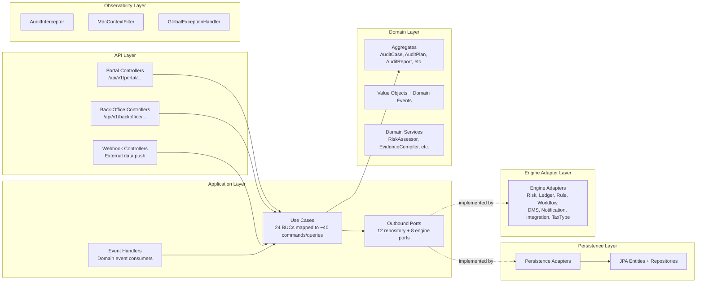

---

## 4. Aggregate Design (Tax Audit Domain)

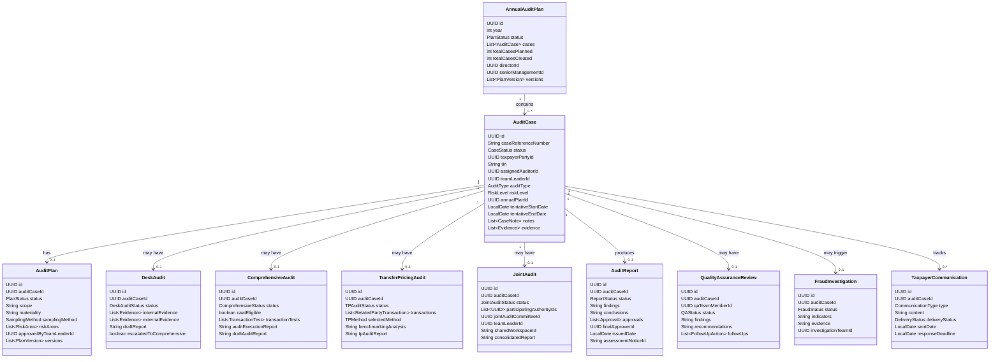

---

## 5. Cluster-by-Cluster BUC Mapping

### Cluster AP — Audit Planning & Setup (7 BUCs)

| BUC | Name | Description | Aggregate | Key Engine Calls |
|:---|:---|:---|:---|:---|
| **TA-001** | Create and Approve Annual Audit Plan | Audit team prepares annual plan; Director reviews; business units feedback; Senior Management approves | `AnnualAuditPlan` | workflow-engine (approval chain), risk-engine (capacity vs effort) |
| **TA-002** | Cascade Audit Plan to Case Level | Break approved plan into individual cases with unique refs | `AuditCase` | registration-service (taxpayer lookup), risk-engine (risk scores) |
| **TA-003** | Select and Prioritize Audit Cases | Process Owner reviews risk-ranked cases; fits within capacity; assigns treatment plans | `AuditCase` | risk-engine (ranking), workflow-engine (capacity check) |
| **TA-004** | Assign Cases to Auditors | Auto-assignment by skills/workload/location; Team Leader can override | `AuditCase` | rule-engine (matching rules), notification-engine (assignment alert) |
| **TA-005** | Plan Individual Audit Case | Auditor reviews data, determines focus, researches industry, prepares plan for Team Leader approval | `AuditPlan` | tax-type-engine (industry benchmarks), integration-engine (3rd party data) |
| **TA-006** | Select and Form Joint Audit Team | Joint Audit Committee reviews cases; assesses suitability; forms team | `JointAudit` | risk-engine (complexity scoring), workflow-engine (committee approval) |
| **TA-007** | Plan Joint Audit | Team collaboratively prepares detailed plan for Committee approval | `JointAudit` | Same as TA-005 + shared workspace coordination |

**State Machine: AnnualAuditPlan**

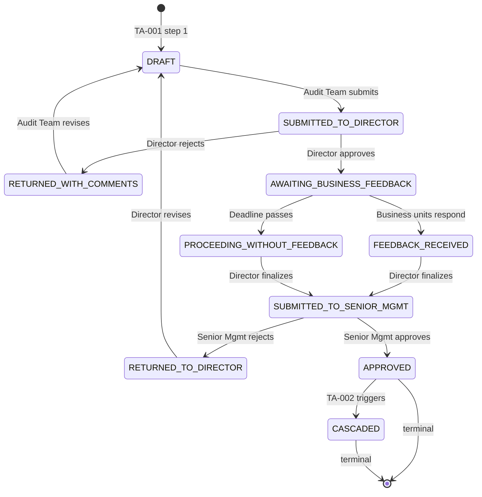

**State Machine: AuditCase (Planning Phase)**

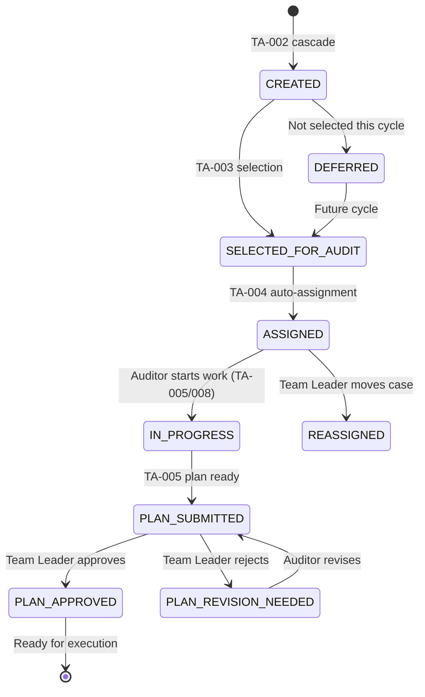

---

### Cluster EX — Audit Execution (2 BUCs)

| BUC | Name | Description | Aggregate | Key Engine Calls |
|:---|:---|:---|:---|:---|
| **TA-009** | Conduct Desk Audit | Remote examination using internal data, 3rd party sources, uploaded docs; draft report; escalate if major issues | `DeskAudit` | integration-engine (banks, customs), tax-type-engine (benchmarks), dms (report storage) |
| **TA-010** | Conduct Comprehensive Audit | In-depth: CAAT, financial verification, industry comparison, 3rd party matching, transaction testing | `ComprehensiveAudit` | risk-engine (anomaly detection), rule-engine (CAAT eligibility), integration-engine, ledger-engine |

**State Machine: DeskAudit**

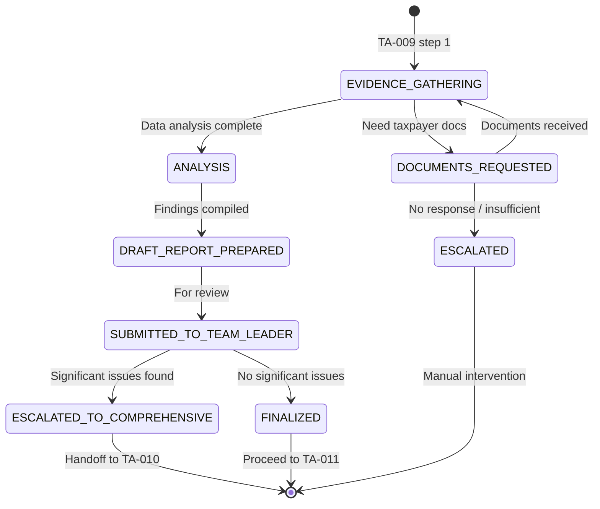

**State Machine: ComprehensiveAudit**

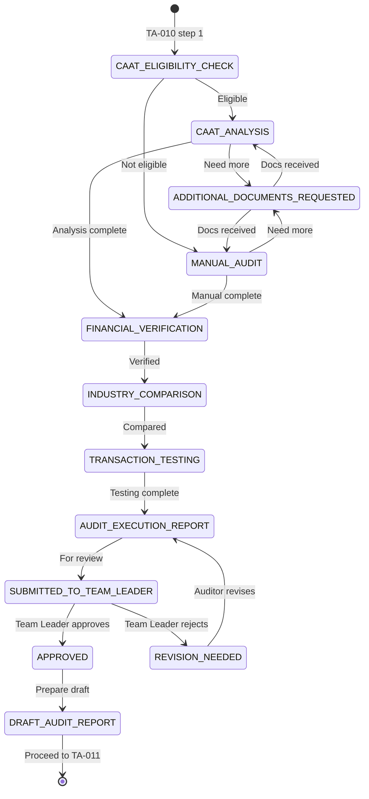

---

### Cluster TP — Transfer Pricing Audit (5 BUCs)

| BUC | Name | Description | Aggregate | Key Engine Calls |
|:---|:---|:---|:---|:---|
| **TA-012** | Initiate Transfer Pricing Audit Case | Identify TP risks; evaluate referrals; Review Committee decides to proceed | `TransferPricingAudit` | risk-engine (TP risk indicators), rule-engine (referral validation) |
| **TA-013** | Plan Transfer Pricing Audit | Materiality, industry research, sampling method, audit plan for approval | `TransferPricingAudit` | tax-type-engine (industry data), rule-engine (TP methods) |
| **TA-014** | Conduct TP Audit Fieldwork | Examine financial records, related-party transactions, verify data, sampling | `TransferPricingAudit` | integration-engine (customs, bank records), ledger-engine |
| **TA-015** | Perform Transfer Pricing Analysis | Analyze transactions using methods (CUP, TNMM, etc.); compare with market data; arm's-length evaluation | `TransferPricingAudit` | rule-engine (method selection logic), integration-engine (comparable data) |
| **TA-016** | Prepare and Review TP Audit Report | Document findings; discuss with taxpayer; internal review and approval | `AuditReport` | dms (report render), workflow-engine (approval) |

**State Machine: TransferPricingAudit**

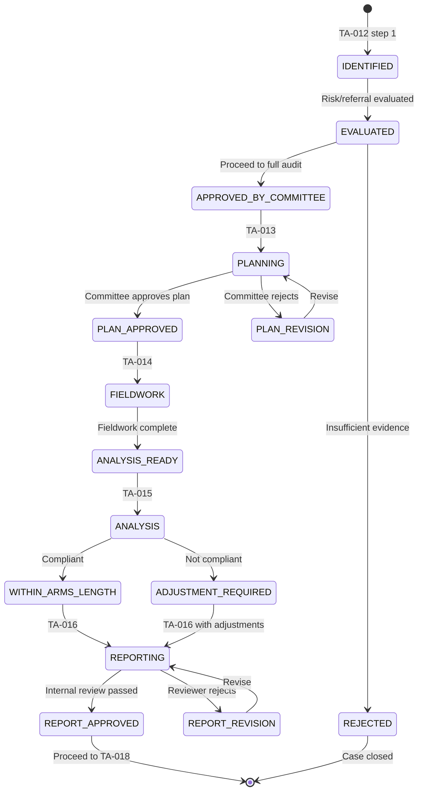

---

### Cluster JA — Joint Audit (3 BUCs)

| BUC | Name | Description | Aggregate | Key Engine Calls |
|:---|:---|:---|:---|:---|
| **TA-008** | Manage Audit Case Progress | Daily work logging; Team Leader monitors; warning signs trigger investigation | `AuditCase` | workflow-engine (SLA), risk-engine (anomaly detection) |
| **TA-021** | Execute Joint Audit | Multiple authorities collaborate via shared workspace; coordinated actions; unified reporting | `JointAudit` | workflow-engine (multi-party approval), dms (shared docs) |
| **TA-022** | Complete and Finalize Audit | Finalize results; exit conference; assessment notice; close case | `AuditReport` | Same as TA-011 + cross-border consolidation |

**State Machine: JointAudit**

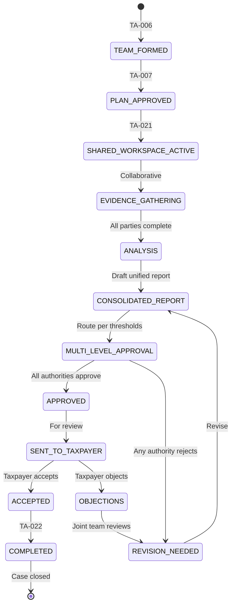

---

### Cluster CM — Communication & Taxpayer Portal (3 BUCs)

| BUC | Name | Description | Aggregate | Key Engine Calls |
|:---|:---|:---|:---|:---|
| **TA-017** | Issue Audit Notices and Manage Communication | Generate notices; track delivery; alternative channels; manage responses | `TaxpayerCommunication` | dms (notice templates), notification-engine (delivery), integration-engine (physical mail) |
| **TA-019** | Conduct Entry Conference with Taxpayer | Schedule, conduct, document initial meeting | `TaxpayerCommunication` | notification-engine (scheduling), dms (minutes storage) |
| **TA-020** | Manage Taxpayer Communication Portal | Secure portal for notifications, document upload, auditor communication | `TaxpayerCommunication` | notification-engine (portal notifications), dms (document storage) |

---

### Cluster RF — Reporting & Finalization (2 BUCs)

| BUC | Name | Description | Aggregate | Key Engine Calls |
|:---|:---|:---|:---|:---|
| **TA-011** | Manage Audit Reporting and Finalization | Working papers, draft report, exit conference, multi-level approval, assessment notice with tracking | `AuditReport` | workflow-engine (approval thresholds), dms (report render + sign), notification-engine |
| **TA-018** | Issue Assessment Notice and Conclude Audit | Final assessment; taxpayer objection period; fraud referral; case closure | `AuditReport` | workflow-engine (objection SLA), ledger-engine (assessment posting), notification-engine |

**State Machine: AuditReport**

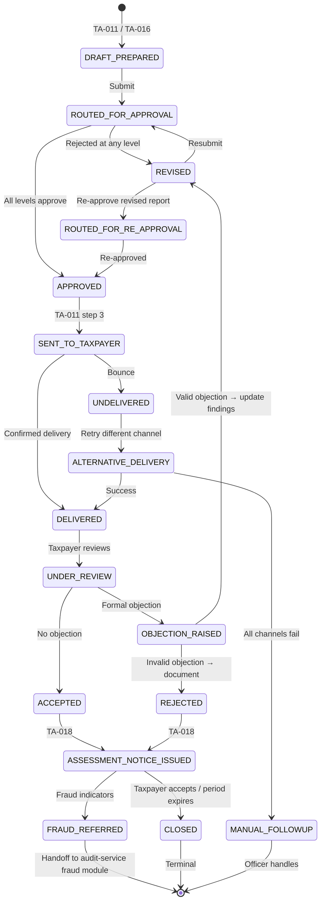

---

### Cluster QA — Quality Assurance & Oversight (2 BUCs)

| BUC | Name | Description | Aggregate | Key Engine Calls |
|:---|:---|:---|:---|:---|
| **TA-023** | Conduct Quality Assurance Review | Select completed audits; review for standards compliance; feedback; track improvements | `QualityAssuranceReview` | rule-engine (sampling method), workflow-engine (review assignment) |
| **TA-024** | Trigger Fraud Investigation | Auto/manual escalation when suspicious activity detected | `FraudInvestigation` | risk-engine (fraud indicators), workflow-engine (escalation), audit-service (handoff) |

**State Machine: QualityAssuranceReview**

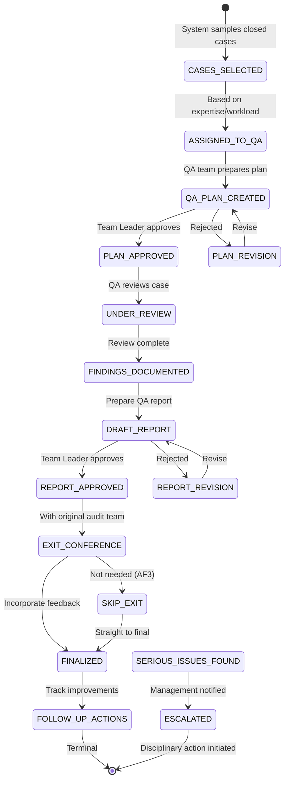

---

## 6. Refined Design Rules (Tax Audit Specific)

### Rule 1 — Audit Case is the Central Aggregate

Every audit activity (planning, execution, reporting, QA) revolves around the `AuditCase` aggregate. It holds:
- `caseReferenceNumber` (unique, auto-generated)
- `taxpayerPartyId` (from party-service via registration-service)
- `tin` (denormalized for convenience)
- `assignedAuditorId` / `teamLeaderId`
- `auditType` (DESK, COMPREHENSIVE, TRANSFER_PRICING, JOINT)
- `status` (lifecycle state)
- `annualPlanId` (link back to plan)

### Rule 2 — Risk Engine Integration at Every Gate

The risk-engine is consulted at multiple points:
- **Planning**: risk-based case selection (TA-003)
- **Assignment**: workload balancing (TA-004)
- **Execution**: anomaly detection during audit (TA-008, TA-010)
- **TP Analysis**: profit-shifting indicators (TA-015)
- **QA**: sampling method for case selection (TA-023)
- **Fraud**: pattern matching for auto-escalation (TA-024)

### Rule 3 — Immutable Audit Trail

Every action on an audit case creates an immutable `AuditTrailEntry`:
- Who (actor ID from `X-Actor-Id` header)
- What (action type: CREATE, UPDATE, APPROVE, REJECT, etc.)
- When (timestamp with timezone)
- Why (reason text for decisions)
- Before/After state (JSON diff)

Stored in `audit_case_audit_log` table with 7-year retention.

### Rule 4 — Document Management via DMS Events

Tax Audit **never** stores PDFs, templates, or signed documents. It emits events:
- `AuditReportRenderRequested` → dms produces PDF
- `AssessmentNoticeRenderRequested` → dms produces notice
- `CertificateRevokeRequested` → dms handles revocation

DMS returns `documentId` which is stored on the aggregate.

### Rule 5 — Taxpayer Communication Portal is Orchestration-Only

The actual secure portal UI is owned by the **portal team** (frontend MFE). Tax Audit service:
- Emits `PortalNotificationRequested` events
- Receives `DocumentUploaded` events from portal
- Validates document links against case
- Does NOT implement file storage, encryption, or session management

### Rule 6 — Ledger Integration for Assessments

When an assessment notice is issued (TA-018):
- Tax Audit calls `LedgerEnginePort.postAssessment(tin, taxType, amount, assessmentNoticeId)`
- Ledger-engine creates the subledger entry (PRINCIPAL account)
- If penalties/interest apply, separate calls for PENALTY and INTEREST accounts
- This is the **only** point where Tax Audit writes to ledger; all other ledger interactions are read-only

### Rule 7 — External Data Fallback

When 3rd party data (banks, customs) is unavailable:
- System uses **last cached snapshot** with warning flag
- Auditor is notified and can proceed with manual verification
- The fallback is logged in audit trail
- No automatic retry that blocks the audit — human decision required

### Rule 8 — Workflow Engine for All Multi-Step Approvals

Any approval chain with more than one step OR with SLA timers goes through workflow-engine:
- Annual plan: Director → Business Units → Senior Management
- Audit plan: Auditor → Team Leader (and Committee for Joint/TP)
- Assessment notice: Auditor → Team Leader → Director (threshold-based)
- QA review: QA Team → Team Leader → (Exit Conference optional)
- Fraud escalation: Auto-flag → Team Leader confirm → Investigation Team

### Rule 9 — Case Management Service for Disputes

Taxpayer objections, appeals, and dispute resolution are **not** handled in Tax Audit. When a taxpayer objects:
- Tax Audit emits `ObjectionRaised` event with case context
- Case-management-service takes over the dispute workflow
- Tax Audit pauses case closure until `ObjectionResolved` event received
- If objection is valid, Tax Audit receives `AuditFindingsRevisionRequired` and re-enters report revision flow

### Rule 10 — Fraud Investigation Handoff

When fraud is detected (TA-024):
- Tax Audit creates `FraudInvestigation` aggregate with `status = PENDING_HANDOFF`
- Emits `FraudInvestigationTriggered` event to audit-service fraud module
- Audit-service creates its own case and takes over
- Tax Audit case is **paused** (not closed)
- On `FraudInvestigationCleared` event, Tax Audit resumes to TA-011/018
- On `FraudSubstantiated` event, Tax Audit case is closed with fraud flag

---

## 7. API Surface Summary

### Portal Endpoints (Taxpayer/Auditor-Authenticated)

| Method | Path | BUC | Purpose |
|:---|:---|:---|:---|
| `GET` | `/api/v1/portal/audit-cases` | TA-008 | Auditor views their assigned cases |
| `POST` | `/api/v1/portal/audit-cases/{id}/daily-work` | TA-008 | Log daily work |
| `GET` | `/api/v1/portal/audit-cases/{id}/progress` | TA-008 | View case progress |
| `POST` | `/api/v1/portal/audit-cases/{id}/evidence` | TA-009/010 | Upload evidence |
| `POST` | `/api/v1/portal/audit-cases/{id}/draft-report` | TA-009/010 | Submit draft report |
| `POST` | `/api/v1/portal/audit-cases/{id}/queries` | TA-010 | Issue formal queries to taxpayer |
| `GET` | `/api/v1/portal/taxpayer/audit-notifications` | TA-017 | Taxpayer views audit notices |
| `POST` | `/api/v1/portal/taxpayer/audit-responses` | TA-017 | Taxpayer responds to notices |
| `POST` | `/api/v1/portal/taxpayer/documents` | TA-020 | Taxpayer uploads documents |
| `POST` | `/api/v1/portal/entry-conferences` | TA-019 | Schedule entry conference |
| `POST` | `/api/v1/portal/entry-conferences/{id}/confirm` | TA-019 | Confirm attendance |
| `POST` | `/api/v1/portal/exit-conferences` | TA-011/022 | Schedule exit conference |

### Back-Office Endpoints (Officer/Team Leader/Director)

| Method | Path | BUC | Purpose |
|:---|:---|:---|:---|
| `POST` | `/api/v1/backoffice/annual-audit-plans` | TA-001 | Create annual plan |
| `GET` | `/api/v1/backoffice/annual-audit-plans/{id}` | TA-001 | View plan |
| `POST` | `/api/v1/backoffice/annual-audit-plans/{id}/submit` | TA-001 | Submit for approval |
| `POST` | `/api/v1/backoffice/annual-audit-plans/{id}/approve` | TA-001 | Director/Senior Mgmt approve |
| `POST` | `/api/v1/backoffice/annual-audit-plans/{id}/cascade` | TA-002 | Generate cases from plan |
| `GET` | `/api/v1/backoffice/audit-cases/pool` | TA-003 | View risk-ranked case pool |
| `POST` | `/api/v1/backoffice/audit-cases/select` | TA-003 | Select cases for audit |
| `POST` | `/api/v1/backoffice/audit-cases/assign` | TA-004 | Auto-assign cases |
| `POST` | `/api/v1/backoffice/audit-cases/{id}/reassign` | TA-004 | Manual reassignment |
| `GET` | `/api/v1/backoffice/audit-cases/{id}/plan` | TA-005 | View audit plan |
| `POST` | `/api/v1/backoffice/audit-cases/{id}/plan` | TA-005 | Submit audit plan |
| `POST` | `/api/v1/backoffice/audit-cases/{id}/plan/approve` | TA-005 | Team Leader approve plan |
| `POST` | `/api/v1/backoffice/audit-cases/{id}/desk-audit/start` | TA-009 | Start desk audit |
| `POST` | `/api/v1/backoffice/audit-cases/{id}/comprehensive-audit/start` | TA-010 | Start comprehensive audit |
| `POST` | `/api/v1/backoffice/audit-cases/{id}/escalate` | TA-009 | Escalate to comprehensive |
| `POST` | `/api/v1/backoffice/audit-cases/{id}/report` | TA-011 | Submit final report |
| `POST` | `/api/v1/backoffice/audit-cases/{id}/report/approve` | TA-011 | Approve report |
| `POST` | `/api/v1/backoffice/audit-cases/{id}/assessment-notice` | TA-018 | Issue assessment notice |
| `POST` | `/api/v1/backoffice/audit-cases/{id}/conclude` | TA-018 | Close audit case |
| `POST` | `/api/v1/backoffice/joint-audit-teams` | TA-006 | Form joint audit team |
| `POST` | `/api/v1/backoffice/joint-audit-teams/{id}/plan` | TA-007 | Submit joint audit plan |
| `POST` | `/api/v1/backoffice/transfer-pricing-audits` | TA-012 | Initiate TP audit |
| `POST` | `/api/v1/backoffice/transfer-pricing-audits/{id}/plan` | TA-013 | Submit TP plan |
| `POST` | `/api/v1/backoffice/transfer-pricing-audits/{id}/fieldwork` | TA-014 | Complete fieldwork |
| `POST` | `/api/v1/backoffice/transfer-pricing-audits/{id}/analysis` | TA-015 | Submit TP analysis |
| `POST` | `/api/v1/backoffice/transfer-pricing-audits/{id}/report` | TA-016 | Submit TP report |
| `POST` | `/api/v1/backoffice/audit-notices` | TA-017 | Generate audit notice |
| `POST` | `/api/v1/backoffice/audit-notices/{id}/delivery-status` | TA-017 | Update delivery status |
| `POST` | `/api/v1/backoffice/qa-reviews` | TA-023 | Start QA review |
| `POST` | `/api/v1/backoffice/qa-reviews/{id}/complete` | TA-023 | Complete QA review |
| `POST` | `/api/v1/backoffice/fraud-investigations` | TA-024 | Trigger fraud investigation |
| `POST` | `/api/v1/backoffice/fraud-investigations/{id}/handoff` | TA-024 | Handoff to audit-service |

### Webhook Endpoints (System-to-System)

| Method | Path | Source | Purpose |
|:---|:---|:---|:---|
| `POST` | `/api/v1/webhooks/risk-engine/score-updated` | risk-engine | Risk score changed for taxpayer |
| `POST` | `/api/v1/webhooks/registration-service/taxpayer-registered` | registration-service | New taxpayer available for audit |
| `POST` | `/api/v1/webhooks/case-management/objection-resolved` | case-management-service | Objection resolved, resume audit |
| `POST` | `/api/v1/webhooks/audit-service/fraud-cleared` | audit-service | Fraud investigation cleared |
| `POST` | `/api/v1/webhooks/audit-service/fraud-substantiated` | audit-service | Fraud substantiated |

### Internal Endpoints (Service-to-Service)

| Method | Path | Caller | Purpose |
|:---|:---|:---|:---|
| `GET` | `/api/v1/internal/audit-cases/{tin}/active` | filing-service, payment-service | Check if taxpayer under audit |
| `GET` | `/api/v1/internal/audit-cases/{tin}/history` | reporting-service | Audit history for KPIs |
| `GET` | `/api/v1/internal/health` | platform | Liveness probe |
| `GET` | `/api/v1/internal/metrics` | observability | Prometheus metrics |

---

## 8. Domain Events Catalog

### Events Emitted by Tax Audit

| Event | Emitted By | Consumed By | Key Payload |
|:---|:---|:---|:---|
| `AnnualAuditPlanCreated` | TA-001 | reporting-service | `planId, year, caseCount` |
| `AnnualAuditPlanApproved` | TA-001 | notification-engine | `planId, approvedBy` |
| `AuditCaseCreated` | TA-002 | risk-engine, notification-engine | `caseId, tin, riskScore` |
| `AuditCaseAssigned` | TA-004 | notification-engine | `caseId, auditorId, teamLeaderId` |
| `AuditCaseReassigned` | TA-004 | notification-engine | `caseId, oldAuditorId, newAuditorId` |
| `AuditPlanSubmitted` | TA-005 | workflow-engine | `caseId, planId, teamLeaderId` |
| `AuditPlanApproved` | TA-005 | notification-engine | `caseId, planId` |
| `DeskAuditStarted` | TA-009 | observability | `caseId, auditorId` |
| `DeskAuditEscalated` | TA-009 | workflow-engine | `caseId, reason` |
| `ComprehensiveAuditStarted` | TA-010 | observability | `caseId, caatEligible` |
| `AuditReportSubmitted` | TA-011 | workflow-engine | `caseId, reportId` |
| `AuditReportApproved` | TA-011 | dms, notification-engine | `caseId, reportId` |
| `AssessmentNoticeIssued` | TA-018 | ledger-engine, notification-engine | `caseId, noticeId, amount` |
| `AuditCaseClosed` | TA-018, TA-022 | reporting-service, notification-engine | `caseId, closureType` |
| `ObjectionRaised` | TA-011 | case-management-service | `caseId, objectionId, taxpayerId` |
| `ObjectionResolved` | (consumed) | workflow-engine | Resume case closure |
| `FraudInvestigationTriggered` | TA-024 | audit-service | `caseId, fraudCaseId, indicators` |
| `FraudInvestigationCleared` | (consumed) | workflow-engine | Resume audit |
| `FraudSubstantiated` | (consumed) | workflow-engine | Close with fraud flag |
| `TPAuditInitiated` | TA-012 | notification-engine | `caseId, tpRiskIndicators` |
| `TPAuditReportApproved` | TA-016 | dms, notification-engine | `caseId, reportId` |
| `JointAuditTeamFormed` | TA-006 | notification-engine | `caseId, teamMembers[]` |
| `JointAuditCompleted` | TA-022 | reporting-service | `caseId, participatingAuthorities[]` |
| `QAReviewCompleted` | TA-023 | reporting-service | `caseId, findings, followUps[]` |
| `EntryConferenceScheduled` | TA-019 | notification-engine | `caseId, date, venue` |
| `EntryConferenceCompleted` | TA-019 | dms | `caseId, minutesDocumentId` |
| `ExitConferenceScheduled` | TA-011 | notification-engine | `caseId, date` |
| `ExitConferenceCompleted` | TA-011 | dms | `caseId, minutesDocumentId` |
| `AuditNoticeDelivered` | TA-017 | workflow-engine | `caseId, noticeId, channel` |
| `AuditNoticeUndelivered` | TA-017 | workflow-engine | `caseId, noticeId, retryCount` |

---

## 9. Data Sanity Check Rules

### Level 1 — Field-Level

| Field | Validation |
|:---|:---|
| `caseReferenceNumber` | Unique, format: `AUD-YYYY-NNNNNN`, auto-generated |
| `tin` | Valid TIN format, must exist in registration-service |
| `taxpayerPartyId` | Valid UUID, cross-check with party-service |
| `auditType` | Enum: DESK, COMPREHENSIVE, TRANSFER_PRICING, JOINT |
| `riskLevel` | Enum: LOW, MEDIUM, HIGH, CRITICAL |
| `samplingMethod` | Enum from tax-type-engine rule package |
| `assessmentAmount` | Non-negative, ≤ 18 digits, 2 decimal places |
| `penaltyAmount` | Non-negative, calculated by rule-engine |
| `interestAmount` | Non-negative, calculated by rule-engine |
| `dates` | `tentativeStartDate` ≤ `tentativeEndDate`; not in past for new plans |
| `status transitions` | Valid per state machine; illegal transitions rejected |

### Level 2 — Cross-Field

| Check | Applied |
|:---|:---|
| Case can only have ONE active audit type at a time | All execution BUCs |
| Auditor assignment must match case complexity to auditor experience | TA-004 |
| Team Leader cannot be same as assigned Auditor | TA-004 |
| Assessment notice can only be issued after report approval | TA-018 |
| Objection period must be within legally configured days | TA-018 |
| QA review cannot be for a case still open | TA-023 |
| Fraud investigation cannot trigger on already-closed case | TA-024 |

### Level 3 — Engine-Mediated

- Risk score calculation → risk-engine
- CAAT eligibility → rule-engine
- TP method selection → rule-engine
- Assessment calculation → ledger-engine (principal + penalty + interest)
- Industry benchmark comparison → tax-type-engine

---

## 10. Git Repository Structure

Per the ITAS Manifesto naming conventions:

```
ITAS/
├── business-solutions/
│   └── taxaudit/
│       ├── bs-taxaudit-core-server        ← This service
│       ├── bs-taxaudit-ui                 ← Angular MFE for back-office
│       └── bs-taxaudit-portal-ui          ← Angular MFE for taxpayer portal
│
├── engines/
│   └── risk/
│       ├── eng-risk-scorer                ← Risk scoring (consumed by tax audit)
│       └── eng-risk-ui
│   └── rule/
│       ├── eng-rule-evaluator             ← Audit procedure rules
│       └── eng-rule-ui
│   └── workflow/
│       ├── eng-workflow-orchestrator      ← Approval workflows
│       └── eng-workflow-ui
│   └── ledger/
│       ├── eng-ledger-journal             ← Assessment posting
│       └── eng-ledger-ui
│   └── integration/
│       ├── eng-integration-gateway          ← Banks, customs, MoTRI
│       └── eng-integration-ui
│
├── adapters/
│   └── risk/
│       └── adp-risk-taxaudit              ← Risk adapter for tax audit domain
│   └── rule/
│       └── adp-rule-taxaudit              ← Rule adapter for tax audit domain
│   └── workflow/
│       └── adp-workflow-taxaudit          ← Workflow adapter for tax audit
│   └── ledger/
│       └── adp-ledger-taxaudit            ← Ledger adapter for tax audit
│   └── integration/
│       └── adp-integration-taxaudit       ← Integration adapter for tax audit
│
├── integrators/
│   └── government/
│       ├── int-government-tax-authority     ← Tax authority APIs
│       └── int-government-customs         ← Customs data
│   └── banking/
│       ├── int-banking-statement          ← Bank statement ingestion
│       └── int-banking-swift              ← SWIFT transactions
│
├── server/libraries/
│   ├── lib-server-auth
│   ├── lib-server-logging
│   ├── lib-server-observability
│   └── lib-server-messaging
│
└── infra/
    └── gitops/
        └── itas-deployment-manifests        ← Umbrella for UAT/Prod
```

---

## 11. Cross-Reference to Original BRS

| Original BRS Section | Refined Location | Notes |
|:---|:---|:---|
| §1.02 TA-001 | Cluster AP | Annual plan creation |
| §1.03 TA-002 | Cluster AP | Case cascade |
| §1.04 TA-003 | Cluster AP | Case selection |
| §1.05 TA-004 | Cluster AP | Auditor assignment |
| §1.06 TA-005 | Cluster AP | Individual audit plan |
| §1.07 TA-006 | Cluster AP | Joint audit team |
| §1.08 TA-007 | Cluster AP | Joint audit plan |
| §1.09 TA-008 | Cluster JA | Case progress (also cross-cutting) |
| §1.10 TA-009 | Cluster EX | Desk audit |
| §1.11 TA-010 | Cluster EX | Comprehensive audit |
| §1.12 TA-011 | Cluster RF | Reporting & finalization |
| §1.13 TA-012 | Cluster TP | TP audit initiation |
| §1.14 TA-013 | Cluster TP | TP audit planning |
| §1.15 TA-014 | Cluster TP | TP fieldwork |
| §1.16 TA-015 | Cluster TP | TP analysis |
| §1.17 TA-016 | Cluster TP | TP report |
| §1.18 TA-017 | Cluster CM | Audit notices |
| §1.19 TA-018 | Cluster RF | Assessment & conclusion |
| §1.20 TA-019 | Cluster CM | Entry conference |
| §1.21 TA-020 | Cluster CM | Taxpayer portal |
| §1.22 TA-021 | Cluster JA | Execute joint audit |
| §1.23 TA-022 | Cluster JA | Complete & finalize |
| §1.24 TA-023 | Cluster QA | Quality assurance |
| §1.25 TA-024 | Cluster QA | Fraud investigation |

---

## 12. Key Design Decisions

| Decision | Rationale |
|:---|:---|
| **Single `bs-taxaudit-core-server`** vs splitting into planning/execution/reporting services | Audit lifecycle is tightly coupled; splitting would create excessive cross-service chatter and consistency issues |
| **AuditCase as central aggregate** | All BUCs operate on a case; natural cohesion point |
| **DMS event-based document handling** | Tax Audit doesn't need to own document rendering, signing, or storage |
| **Ledger write only at assessment** | Audit is about investigation; ledger is about financial recording; separation of concerns |
| **Case-management-service for disputes** | Disputes have their own SLA, appeal chains, and legal workflows; don't duplicate |
| **Audit-service fraud module for investigations** | Fraud investigation is a specialized domain with different procedures, legal requirements, and teams |
| **Risk-engine at every gate** | Risk-based approach is core to modern tax audit; not just planning but ongoing monitoring |

---

This architecture document provides the complete blueprint for implementing the Tax Audit domain within the ITAS ecosystem, following the same patterns, conventions, and quality standards established by the registration service and the engineering manifesto.
