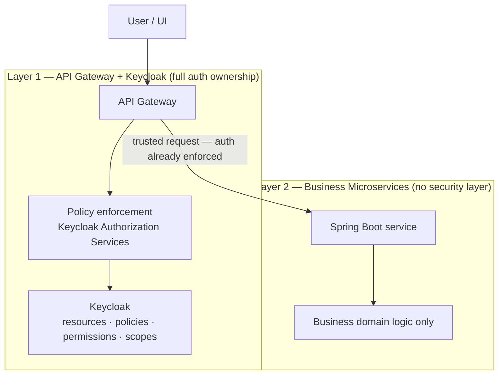
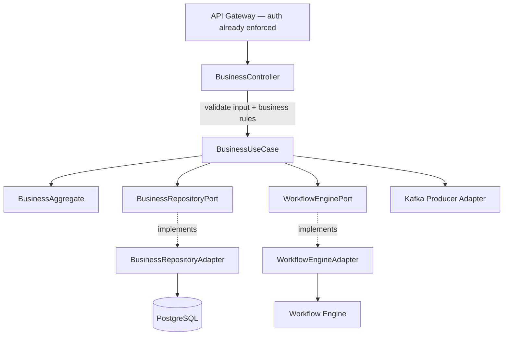
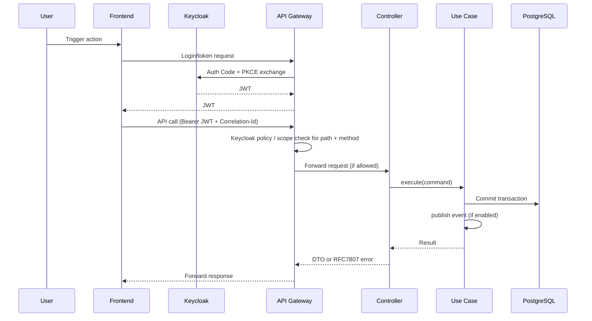
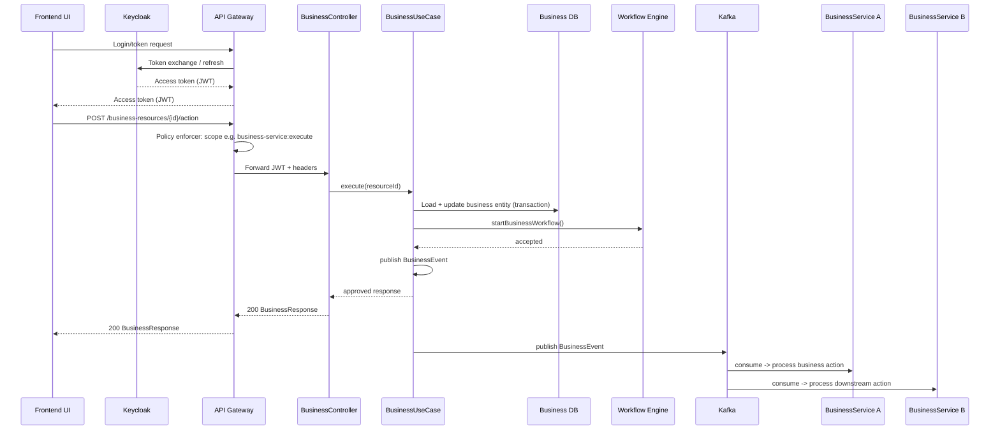
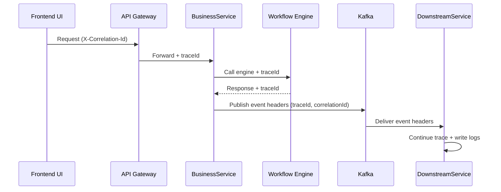

# ITAS Service Internal Architecture Standard

**Stack:** Spring Boot, PostgreSQL, Keycloak, optional Kafka  

---

### **1. Document Control & Metadata**

| Field | Value |
|------|--------|
| **Document title** | ITAS Service Internal Architecture Standard |
| **Version** | 1.0 |
| **Status** | Draft |
| **Last updated** | 2026-03-27 |
| **Owner** | Platform Architecture Team |

**Change log**

| Version | Date | Author | Summary of changes |
|--------|------|--------|-------------------|
| 1.0 | 2026-03-27 | Platform Architecture | Initial internal service structure standard for ITAS |

**Review & approval** (complete before *Approved* status)

| Role | Name | Signature / Date |
|------|------|------------------|
| Architecture lead | | |
| Security lead | | |
| Engineering lead | | |

**Glossary**

| Term | Definition |
|------|------------|
| **Bounded context** | Domain boundary; typically one microservice. |
| **Hexagonal architecture** | Ports and adapters — domain isolated from infrastructure. |
| **Keycloak Authorization Services** | Resources, policies, scopes for fine-grained access. |
| **RFC 7807** | Standard JSON format for HTTP API problem details. |

---

### **2. Introduction & Executive Summary**

**Problem statement**

ITAS includes multiple cooperating services. Without one internal structure standard, teams duplicate logic, couple business rules to infrastructure, and create inconsistent security and operations practices.

**System purpose**

Define and standardize the internal structure of every ITAS service: layers, dependency rules, authorization boundaries, integration adapter patterns, and operational quality gates.

**Scope — in scope**

- Mandatory internal package/layer structure for all ITAS backend services  
- DDD + hexagonal dependency boundaries and adapter patterns  
- Service-side security model (JWT validation + business authorization boundaries)  
- Standard observability, testing, API, and CI quality gates for services  

**Scope — out of scope (for this standard)**

- Business policy/legal content

**Success metrics (examples)**

- Consistent service structure enforceable in CI (ArchUnit)  
- Single authz pattern: Keycloak as source of truth; gateway primary for external API access  
- JaCoCo coverage floor and integration smoke paths per service  
- Traceability UI → gateway → service → engine/Kafka via correlation and trace IDs  

**Stakeholders**

- Ministry of Revenue — CIO  
- Product management  
- Platform and service engineering leads  
- Security and operations  

---

### **3. Architectural Views**

#### **3.1 Logical View**

Every microservice follows this base structure (**six layers**):

1. **API** (`api/`) — Controllers, DTOs, global exception handler (RFC 7807).  
2. **Application** (`application/`) — Use cases (`execute()`), ports, orchestration, `@Transactional`.  
3. **Domain** (`domain/`) — Aggregates, value objects, domain events, domain exceptions.  
4. **Persistence** (`persistence/`) — JPA entities, repositories, adapters, mappings.  
5. **Engine Adapter** (`engineadapter/`) — Workflow / Decision / Ledger via ports.  
6. **Observability** (`observability/`) — Audit, tracing, metrics.  

**Optional:** **Messaging** (`messaging/`) — Kafka producers/consumers only when needed.

> **Security note:** There is no `security/` layer inside business services. All authentication and authorization is fully handled at the API Gateway and Keycloak. Business services receive pre-validated, trusted requests from the gateway only and do not perform any JWT validation or Spring Security configuration.

**Service boundaries (illustrative)**

Sized by bounded context and business capability. Service names are intentionally generic at this stage. Exact service list is product-owned.

**Communication patterns**

| Pattern | Use | Technology |
|--------|-----|------------|
| Synchronous | Request/response | HTTPS REST (internal); optional gRPC later |
| Asynchronous | Side effects, notifications | Kafka (optional per service) |

**Orchestration vs choreography**

- **Workflow engine:** human/task workflows where the engine owns state.  
- **Choreography:** domain events over Kafka for cross-service reactions (e.g. downstream consumers).

**Layered authorization (overview)**

**Single-service component flow**

**Optional engine adapter plug-in model**

- Use cases depend on engine **ports** (interfaces), not concrete clients.  
- Adapters exist only in services that need them (`WorkflowEnginePort` → `WorkflowEngineAdapter`, etc.).  
- Spring wires only adapters present in that service.

#### **3.2 Data View**

| Topic | Decision |
|-------|----------|
| **Primary OLTP** | PostgreSQL per microservice (database per service; no shared DB across bounded contexts). |
| **Schema management** | Flyway versioned migrations; `ddl-auto: validate` where applicable. |
| **Domain vs JPA** | JPA entities separate from domain model; mapping layer (e.g. MapStruct). |
| **Consistency** | ACID within a service transaction; cross-service eventual consistency via Kafka when used. |
| **Backup / DR** | Platform standard — frequency, retention, restore tests in operations runbooks. |

#### **3.3 Behavioral View**

**UI → gateway → service (token and API)**

**Full journey (UI through engines and Kafka)**

**Failure handling**

- Engine calls: timeout, retry (transient), circuit breaker, map errors to RFC 7807.  
- Kafka: consumer idempotency; dead-letter handling per platform standard.  

**Distributed tracing (correlation)**

---

### **4. Design Principles & Patterns**

**Core rules**

- All authentication and authorization is owned entirely by the **API Gateway** and **Keycloak**. Business services have no security filter, no JWT validation, and no Spring Security configuration.  
- Controllers: **input validation**, then use case.  
- **Business authorization** (ownership, jurisdiction, workflow state) lives in **domain / use case** only — not in a security layer.  
- Use cases orchestrate only; domain holds business rules; application talks to externals only through **ports**.  
- If Kafka is used, publish via **messaging adapters** after the operation completes.

**Principles**

| Principle | Application |
|-----------|-------------|
| API-first | OpenAPI per service |
| Hexagonal | External systems only via ports |
| Gateway-owned security | Keycloak + gateway own all authn/authz; services have no security layer |
| Zero security duplication | No Spring Security, no JWT filter, no `@PreAuthorize` in business services |
| Immutable infra (target) | Versioned migrations, config via env/secrets |

**Patterns**

- Circuit breaker / retry on engine and external HTTP adapters.  
- Optional Kafka for integration; transactional consistency within the service DB.  

**ADRs**

- **ADR-001:** DDD + hexagonal per service.  
---

### **5. Non-Functional Requirements (NFRs)**

| Category | Target (tune per environment) |
|----------|-------------------------------|
| **Availability** | Align to business SLA (e.g. 99.9% — define per tier). |
| **Scalability** | Stateless services; horizontal scale; pools sized per load test. |
| **Performance** | API p95 targets per critical journey; gateway policy caching to limit Keycloak round-trips. |
| **Resilience** | Circuit breakers on engine calls; graceful degradation per adapter. |

---

### **6. Security Architecture**

**Layered model**

| Layer | Responsibility | What we avoid |
|-------|----------------|---------------|
| **Gateway** | JWT validation, path/method → scope/permission, rate limiting, routing | — |
| **Keycloak** | Clients, roles, Authorization Services resources/policies | — |
| **Business Microservice** | Business domain logic only | Any form of JWT validation, Spring Security config, or auth filter |

**Gateway: Keycloak policy enforcement**

- Model APIs as **resources** and operations as **scopes** in Authorization Services.  
- Enforce per route (path + HTTP method).  
- Lazy loading / caching of policy decisions where supported.  
- Keep gateway config and Keycloak definitions in sync (CI or generated from OpenAPI).

**Spring Cloud Gateway note:** Policy Enforcer servlet adapter targets blocking apps. On reactive gateways use custom `GatewayFilter`, OAuth2 Resource Server + `AuthorizationManager`, or HTTP calls to Keycloak’s authorization API with caching.

**Business Microservices**

- **Must not** include Spring Security, JWT filters, or any auth configuration.  
- **Must** assume every incoming request has already been authenticated and authorized by the gateway.  
- **Must** enforce business-level rules (ownership, workflow state, jurisdiction) in domain/use case only.  

**Interaction matrix**

| Interaction | Protocol | Auth | Enforcement |
|-------------|----------|------|-------------|
| UI → Gateway | HTTPS | User JWT | Gateway: JWT validation + Keycloak policy |
| Gateway → Service | HTTP internal | None (trusted internal network) | No auth in service — gateway already enforced |
| Service → Service | HTTP/gRPC | Internal network trust | Business rules only if needed |
| Service → Engine | HTTP | Service identity | Adapter + resilience |
| Kafka | — | Cluster auth | Producer/consumer adapters + idempotency |

---

### **7. Observability & Operational Governance**

**Logging (structured JSON)**

Minimum fields: `timestamp`, `level`, `service`, `environment`, `traceId`, `correlationId`, `actorId` (if available), `operation`, `outcome`, and on failure `errorCode` / `errorMessage`.

- Avoid PII in logs; mask where needed.  
- Log business outcomes at use-case boundary.  

**Tracing**

- Generate `traceId` at first ingress if missing.  
- Propagate `traceId` and `X-Correlation-Id` across UI → gateway → service → engine → Kafka.  

**Metrics**

- Request latency, error rate, engine adapter failures, Kafka lag (if used).  

**Alerting**

- Thresholds and on-call — operations runbooks.  

---

### **8. API & Integration Strategy**

- **Errors:** RFC 7807 everywhere.  
- **Correlation ID** on all inbound/outbound calls.  
- **Contracts:** OpenAPI per service; review on change.  
- **Versioning:** URI or header — one platform-wide rule; deprecation policy for breaking changes.  
- **Idempotency:** keys for retried writes where applicable.  
- **Rate limiting:** at gateway (tiers / quotas).  
- **Topic naming (Kafka):** `{context}.{event}.v{n}`.  

**Per-service deliverables**

1. OpenAPI spec  
2. Gateway + Keycloak policy/scope matrix for that service’s paths (owned with platform IAM)  
3. One end-to-end sequence diagram  
4. Outbound dependency table (services / engines / Kafka)  
5. AsyncAPI (only if Kafka is used)  

---

### **9. Deployment & DevOps Strategy**

- **Environments:** dev, staging, production; config via env vars; secrets injected.  
- **Migrations:** Flyway; backward-compatible changes preferred; rollback plan for risky changes.  
- **Release:** rolling updates; readiness/liveness; optional blue-green/canary per ops.  

**CI quality gates (merge requests)**

1. Unit tests pass  
2. ArchUnit dependency rules pass  
3. JaCoCo line coverage ≥ **80%** (excluding generated code)  
4. Integration smoke tests pass  
5. No critical static-analysis / dependency scan failures  

---

### **10. Frontend & Client Architecture**

**Module structure**

- `app-shell/` — routing, layout, navigation  
- `modules/{bounded-context}/` — feature modules  
- `modules/shared/` — shared UI  
- `infrastructure/http/` — API client, token handling, interceptors  
- `infrastructure/state/` — cross-module state only  
- `infrastructure/observability/` — frontend logs, trace/correlation support  

**Interaction states per call:** `loading`, `success`, `error` (RFC 7807 mapped), `unauthorized`.

**Auth:** token via **gateway-mediated** flows; API calls to gateway with bearer token.

**Performance:** Core Web Vitals and startup targets — set per product.

---

### **11. Migration & Rollout Strategy**

- New services follow this architecture from day one.  
- **Strangler** for legacy: extract bounded contexts behind APIs.  
- **Feature flags** for risky changes; pilot tenants/regions if applicable.  
- **Rollback:** revert deployment; disable flags; DB rollback only when safe.  

---

### **12. Testing Strategy**

| Layer | Focus |
|-------|--------|
| **Unit** | Domain rules; use case orchestration; controller validation |
| **Integration** | API + DB; engine stubs; Kafka testcontainers if used |
| **Contract** | Consumer-driven or OpenAPI diff in CI for critical APIs |
| **E2E** | Critical journeys in staging |
| **Security** | SAST/DAST and dependency scanning in pipeline (pipeline only — no in-service auth tests) |

**Integration tests should cover:** one happy path per endpoint; one downstream failure; Kafka path if applicable. No 401/403 tests inside business services — auth is the gateway's responsibility.

**Per-layer emphasis**

- **Domain:** invariants, transitions, value objects  
- **Controller:** input validation only (no auth checks)  
- **Use case:** orchestration and transaction boundaries  
- **Adapter:** engine error mapping, retry/circuit behavior  
- **Kafka:** publish and consumer idempotency  

---

### **13. Technology Stack & Rationale**

| Layer | Choice | Rationale |
|-------|--------|-----------|
| **Runtime** | Java, Spring Boot | Ecosystem, maturity, security/observability support |
| **Data** | PostgreSQL | ACID OLTP for service-local data |
| **IAM** | Keycloak | OIDC/OAuth2, Authorization Services |
| **Gateway** | Spring Cloud Gateway (or org standard) | Routing; integrates with Spring Security OAuth2 |
| **Messaging** | Kafka (optional) | Durable log; use where integration needs it |
| **Build / quality** | Maven, JaCoCo, ArchUnit | Coverage and architecture gates in CI |
| **Deployment** | Docker, Kubernetes | Standard cloud-native model |

**Alternatives considered:** monolith (rejected for large-program team independence); duplicate per-service RBAC mirroring gateway (rejected).
